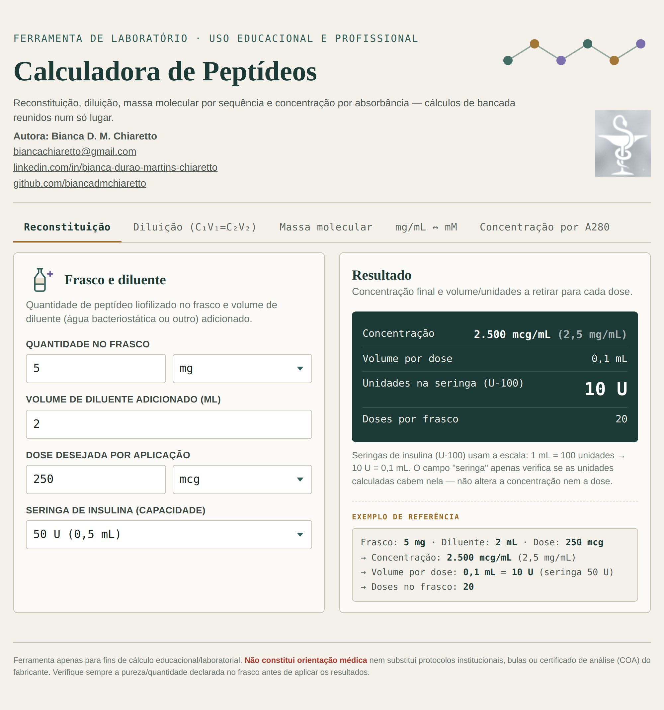
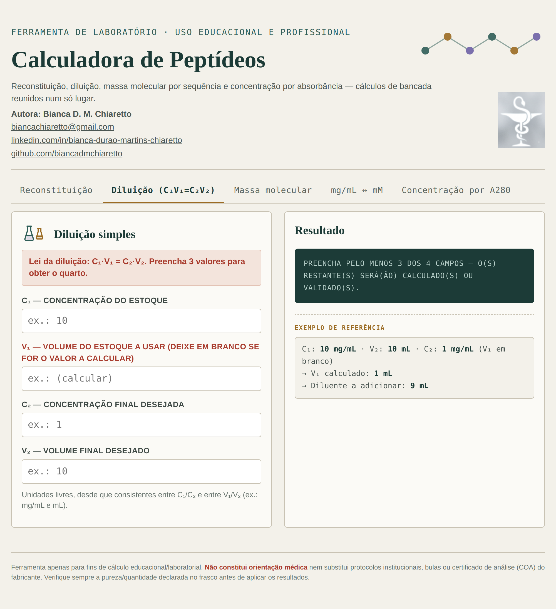
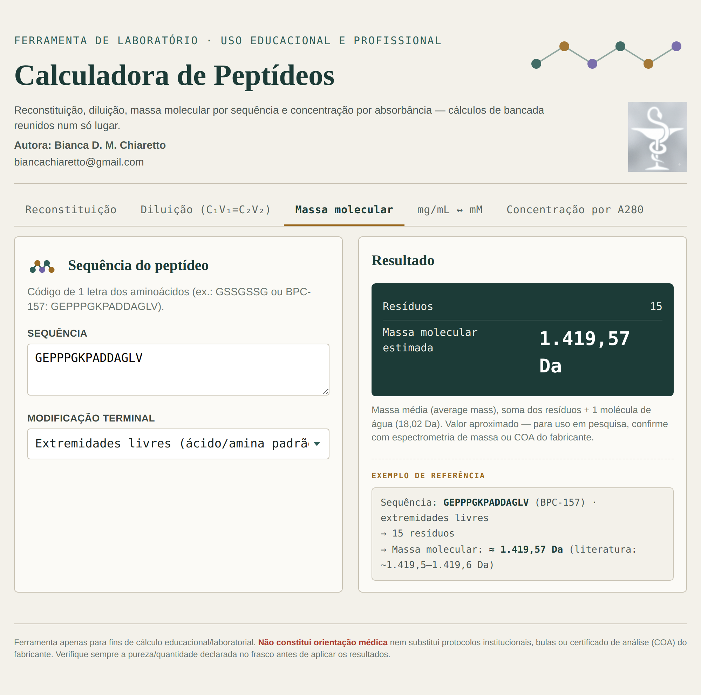
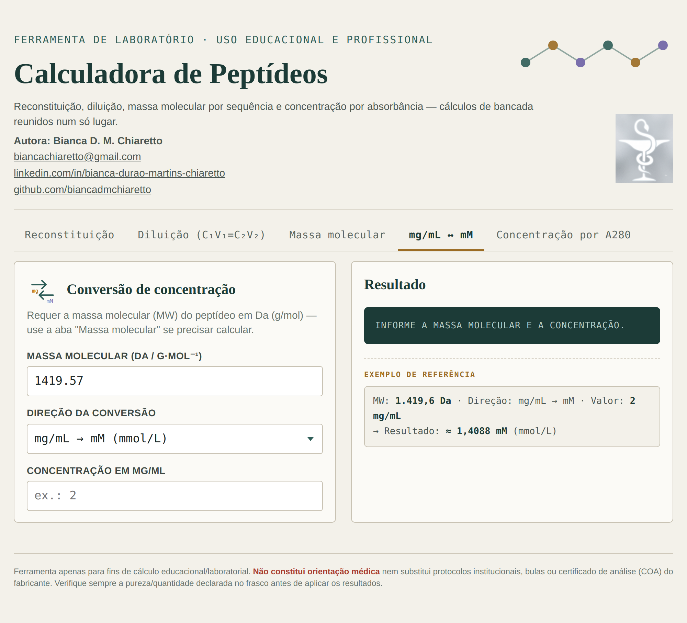
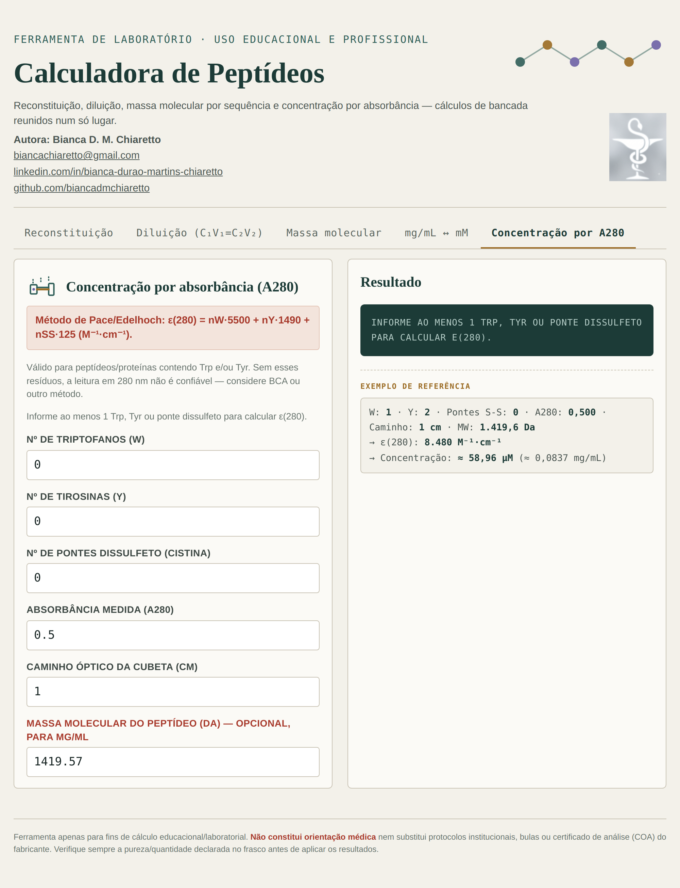

# 🧬 Calculadora de Peptídeos

Ferramenta de laboratório para cálculos de bancada envolvendo peptídeos: reconstituição, diluição, massa molecular por sequência, conversão de concentração e determinação por absorbância (A280) — tudo reunido em um único lugar.

**Autora:** Bianca D. M. Chiaretto
**Contato:** biancachiaretto@gmail.com

> ⚠️ Ferramenta apenas para fins de cálculo educacional/laboratorial. Não constitui orientação médica nem substitui protocolos institucionais, bulas ou certificado de análise (COA) do fabricante.

---

## 📥 Como usar

Esta calculadora é um arquivo único (`calculadora-peptideos.html`) que roda **inteiramente no seu navegador**, sem precisar instalar nada, sem internet e sem enviar nenhum dado para servidor algum.

**Passo 1 — Baixar o arquivo**
Clique no arquivo [`calculadora-peptideos.html`](./calculadora-peptideos.html) acima neste repositório → botão **"Download raw file"** (ícone de seta para baixo) → salve em qualquer pasta do seu computador.

**Passo 2 — Abrir no navegador**
Dê duplo clique no arquivo baixado. Ele abre automaticamente no seu navegador padrão. Se preferir escolher manualmente, clique com o botão direito → **"Abrir com"** → selecione um dos navegadores abaixo:

| Navegador | Funciona? |
|---|---|
| 🟢 Google Chrome | ✅ Sim |
| 🟠 Mozilla Firefox | ✅ Sim |
| 🔵 Microsoft Edge | ✅ Sim |
| 🧭 Safari (Mac/iPhone) | ✅ Sim |

Não precisa de conexão com a internet depois de baixado — todos os cálculos rodam localmente no seu navegador.

---

## 🖥️ Telas da calculadora

### 1. Reconstituição
Calcula a concentração final e o volume por dose a partir da quantidade de peptídeo liofilizado no frasco e do diluente adicionado.

### 2. Diluição (C₁V₁ = C₂V₂)
Aplica a lei da diluição: preencha 3 dos 4 valores (concentração/volume inicial e final) para calcular o quarto, ou preencha os 4 para conferir se os valores batem entre si.

### 3. Massa molecular
Estima a massa molecular de um peptídeo a partir da sequência de aminoácidos (código de 1 letra).

### 4. mg/mL ↔ mM
Converte concentração entre mg/mL e mM (mmol/L), a partir da massa molecular do peptídeo.

### 5. Concentração por A280
Calcula a concentração de um peptídeo/proteína a partir da absorbância medida a 280 nm, pelo método de Pace/Edelhoch — válido para sequências contendo triptofano (Trp) e/ou tirosina (Tyr).

---

## 🛠️ Tecnologia

HTML, CSS e JavaScript puros — um único arquivo, sem dependências externas, sem build, sem instalação. Desenvolvido com apoio de Inteligência Artificial (Claude, Anthropic).

## 📄 Licença

Uso livre para fins educacionais e de estudo.
